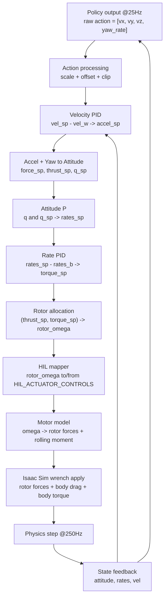

# UAV RL

This repo is where I am building a training stack for UAVs for different purposes, starting with stable manager-based RL tasks in Isaac Lab and expanding from there.

## Overview

`uav_rl` is centered on one thing right now: getting strong task definitions and a repeatable train/eval loop for quadrotor control.

Current focus:

- Manager-based UAV tasks in Isaac Lab.
- PX4-like velocity-control action pipeline on an Iris quadrotor asset.
- Fast iteration with RSL-RL training and checkpoint playback.

Transfer workflows are not the priority yet, so this README keeps that part intentionally brief.

## Installation

1. Install Git LFS (required for USD and model artifacts):

```bash
git lfs install
```

2. Install Isaac Lab by following the official guide:
   https://isaac-sim.github.io/IsaacLab/main/source/setup/installation/index.html

3. Clone this repo outside your Isaac Lab directory.

4. Install this package in editable mode:

```bash
# use 'PATH_TO_isaaclab.sh|bat -p' if Isaac Lab is not in your active python env
python -m pip install -e source/uav_rl
```

5. Quick sanity check:

```bash
python scripts/list_envs.py
```

## Running Tasks

Primary workflow (RSL-RL):

```bash
python scripts/rsl_rl/train.py --task vanilla --headless
```

Play latest checkpoint:

```bash
python scripts/rsl_rl/play.py --task vanilla --headless
```

Useful options:

- `--num_envs <N>`: override default number of parallel envs.
- `--run_name <name>`: suffix run folder name.
- `--load_run <run_dir>`: pick a specific run directory during play/resume.
- `--checkpoint <path/to/model.pt>`: load a specific checkpoint file.
- `--debug_actions`: print policy action channels (`vx, vy, vz, yaw_rate`) during play.

Zero/random-agent smoke tests:

```bash
python scripts/zero_agent.py --task vanilla --headless
python scripts/random_agent.py --task vanilla --headless
```

## RL Tasks

RL Task list:

| Task          |   Robot    |   Hardware Tested?   | Description                                                      |
|---------------|:----------:|:--------------------:|------------------------------------------------------------------|
| `vanilla` |     IRIS     |  ❌  | Basic UAV Hover policy, to understand the env cfg |

## Task Channel Breakdown (`vanilla`)

The `vanilla` environment is currently the center of development.

Action channel (policy output):

- 4D command: `[vx, vy, vz, yaw_rate]`.
- Commands are scaled, then clipped to velocity/yaw limits before control allocation.

Observation channel (policy input):

- Relative position, quaternion, linear velocity, angular velocity.
- Projected gravity, last action.
- Command channels (`command_velocity`, `command_yaw_rate`) for conditioning.

Reward channel:

- `alive` reward.
- Termination penalty.
- Penalties on horizontal speed, vertical speed, and angular rate.
- Upright-orientation penalty (`flat_orientation_l2`).

Termination channel:

- Timeout.
- Minimum/maximum height violations.
- XY out-of-bounds check.

Environment defaults:

- `num_envs=1024`
- `dt=1/250`
- `decimation=10`
- `episode_length_s=10.0`


## PX4-Like Control/Data Flow (`vanilla`)

This task uses a PX4-style cascaded controller implemented in Torch and executed inside the Isaac Lab action term.

### Motivation

This cascaded PX4-like loop is deployed to convert high-level policy commands (`[vx, vy, vz, yaw_rate]`) into physically consistent thrust and body-torque commands for the simulator while preserving PX4 control semantics (velocity -> acceleration -> attitude -> rates -> allocation). That keeps the training control interface close to the real flight stack and reduces the sim-to-real gap versus directly commanding forces.

The ideal setup would be full PX4 SITL in the loop, but at `--num_envs ~ 2048` that is not practical: running thousands of parallel PX4 instances collapses throughput and makes large-batch RL training inefficient. So this repo uses a fully Torch-based PX4-like controller for high-throughput pretraining, then fine-tunes the pretrained policy with real PX4 SITL using far fewer environments before deployment.

### Flowchart



### Equations used in the pipeline

1) Policy command to controller setpoint

- `u_raw = [vx, vy, vz, yaw_rate]`
- `u_sp = clip(u_raw * action_scale + action_offset)`

2) Velocity loop (PID)

- `e_v = v_sp - v`
- `a_sp = a_ff + Kp_v * e_v + Ki_v * int(e_v) + Kd_v * d(e_v)/dt`
- `a_sp_xy` and `a_sp_z` are limited by configured accel limits.

3) Acceleration + yaw to thrust/attitude

- `F_sp = m * (a_sp + g * e_z)`
- `T_sp = ||F_sp||` (clamped to thrust limits)
- Desired body z-axis aligns with `F_sp`, with tilt limit.
- Desired attitude `q_sp` is built from desired body axes and yaw setpoint.

4) Attitude and rate loops

- `e_R = 0.5 * vee(R_sp^T R - R^T R_sp)`
- `omega_sp = -Kp_att * e_R`, with `omega_sp_z += yaw_rate_sp`
- `e_omega = omega_sp - omega`
- `tau_sp = Kp_rate * e_omega + Ki_rate * int(e_omega) - Kd_rate * d(omega)/dt`

5) Allocation/mixing to rotor speed

- Build allocation matrix `A` from rotor geometry/constants.
- `[T_sp, tau_x, tau_y, tau_z]^T = A * omega^2`
- `omega^2 = A^+ * [T_sp, tau_sp]^T`, then clamp and normalize to rotor limits.
- `omega = sqrt(max(omega^2, 0))`

6) HIL actuator controls mapping

- `controls = clip((omega - zero_position_armed) / input_scaling - input_offset)`
- Inverse mapping is used to recover `omega` from `controls`.

7) Motor model and wrench to Isaac Sim

- Rotor thrust per motor: `F_i = k_i * omega_i^2`
- Rolling moment: `tau_roll_z = sum(c_i * rot_dir_i * omega_i^2)`
- Body drag: `F_drag = -C_drag .* v_body`
- Applied in sim as rotor +Z forces, body drag force, and body Z torque.

### Frequency in this repo

- Physics step: `250 Hz` (`sim.dt = 1/250`)
- Policy step: `25 Hz` (`decimation = 10`)
- Controller step: `250 Hz` (action term `apply_action()` runs each physics tick)
- Policy setpoint is held constant across the 10 inner physics/controller ticks.

### Source mapping (implementation)

- Action term and force application: `source/uav_rl/uav_rl/tasks/manager_based/vanilla/mdp/actions.py`
- Cascade controllers and HIL mapper: `source/uav_rl/uav_rl/tasks/manager_based/vanilla/controllers/px4_like_pipeline.py`
- Allocator/motor model wrapper: `source/uav_rl/uav_rl/tasks/manager_based/vanilla/controllers/px4_like_controller.py`
- Pegasus multirotor reference: `../PegasusSimulator/extensions/pegasus.simulator/pegasus/simulator/logic/vehicles/multirotor.py`

### PX4 references

- PX4 controller diagrams (Multicopter Control Architecture):
  - `https://docs.px4.io/main/en/flight_stack/controller_diagrams.html`

## Logs

RSL-RL runs are saved under:

```text
logs/rsl_rl/vanilla/<timestamp>_<optional_run_name>/
```

## Transfer (Current Status)

Transfer is intentionally light in this repo right now. The current stage is task and policy training maturity first; transfer docs and tooling will follow once the task channel is stable.

## Code Formatting

```bash
pip install pre-commit
pre-commit run --all-files
```
